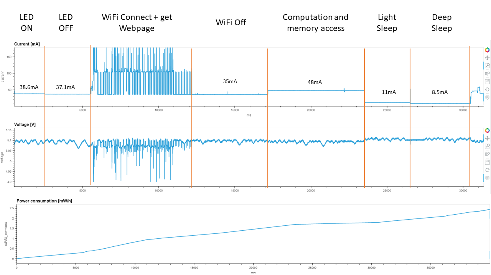
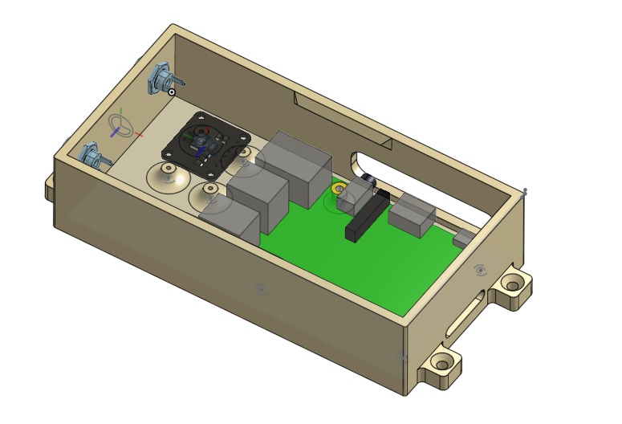

PowerPi
# Motivation
While developing low-powered MCU systems (battery-powered), I wanted to figure out how much power my system is using and at what times.   
I came across [this](https://youtu.be/LUB8RWzzLWc?si=opCwQNiDN8U8gNQn&t=515) video and in it, the [Nordic Power Profiler Kit II](https://www.nordicsemi.com/Products/Development-hardware/Power-Profiler-Kit-2).  
Having a RPi and [INA219](https://www.adafruit.com/product/904)  at hand, I decided to build my own power profiler.

# Goals
1. Measure and show current draw, voltage stability and overall power usage
2. Control, visualize and analyze easily from a web browser

## Features
- [x] "Ultra Fast" measurements (uS) (e.g. to show power spikes in MCUs)
- [x] "Slow" measurements (seconds, minutes) for long-term power system analysis (e.g. battery charging and solar systems)
- [x] Save measurements to CSV
- [ ] Integration with CC/CV source to make it a more powerful lab tool

## Improvements
- [ ] Move to better visualization platform
- [ ] Add script to configure as a boot service using systemd
- [ ] Clean the code
- [ ] 

### MCU (ESP32) Power Monitoring Example

## System Overview
### Hardware
1. Raspberry Pi 3B+ (plus has WiFi built-in) connected to INA219 using I2C 
2. INA219 in series (high side) between power source and load
   1. Up to 26VDC
   2. Up to 3.2A
3. Common ground between measured circuit and PowerPi

### Software
1. Based on [pi-ina219](https://pypi.org/project/pi-ina219/) library
2. Uses [Panel](https://panel.holoviz.org/) and [Holoviews](https://holoviews.org/) for web server and visualization
   1. *This probably not the best way, but it's the only tool I feel comfortable with for now* 
# Getting Started
## Installation
1. Burn a Raspbian image on a MicroSD card, connect to a WiFi and get the IP address
1. Install [pigpio](https://abyz.me.uk/rpi/pigpio/download.html) - used for get_current_tick() to get micro-seconds precision

    > wget https://github.com/joan2937/pigpio/archive/master.zip  
    unzip master.zip  
    cd pigpio-master  
    make  
    sudo make install  

2. Install pip (to download python libraries) - 
    > sudo apt install python-pip
3. Download Python libraries
    > pip install holoviz panel holoviews pi-ina219 
4. Start pigpio daemon (every reboot)
    > sudo pigpiod
5. Clone repo
    > git clone https://github.com/saharco540/PowerPi.git
6. Start server
    > panel serve panel.py --allow-websocket-origin=* --port=8080
7. Locate your RPi IP address and open a browser to http://IP:8080 or if hostname is powerpi - http://powerpi.local:8080

## Wiring

Please read further [here](https://learn.adafruit.com/adafruit-ina219-current-sensor-breakout/overview)

# Usage
Tabs for different modes
   1. Data Logger - Start data logging to CSV for long-term measurements and later analysis
   2. Live View - Live visualization of current and voltage
   3. Data Explorer - Visualize and analyze data from CSV files

# Extras
3D Printed box available (3d-box.stl)  

